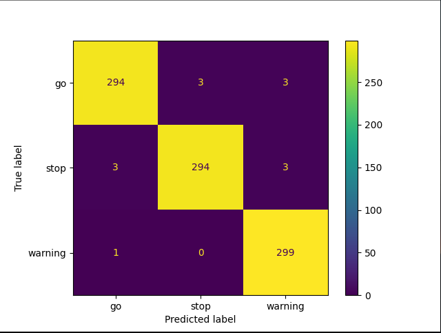
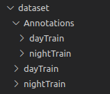

# Título:
## Detector de Semáforos
---
# Equipe
## *Gustavo Ferreira Palma
---
# Dataset
LISA Triffic Light Dataset [https://www.kaggle.com/datasets/mbornoe/lisa-traffic-light-dataset]

---

# Descrição do Projeto
O presente projeto tem por objetivo localizar e identificar semáforos em imagens e classificar seus estados em 'Go' (Verde), 'Warning' (Amarelo) e 'Stop' (Vermelho). O Dataset é baseado em fotos extraídas de vídeos reais, aquisitados em períodos do dia e da noite para uma maior confiabilidade

---

# Classificadores e Acurácia
Durante o desenvolvimento do projeto foram testados diferentes classificadores, permanecendo apenas o Classificador SVM na versão final, já que este obteve a melhor acurácia:
Testando Classificador - Reporte do SVM
              precision    recall  f1-score   support

          go       0.99      0.98      0.98       300
        stop       0.99      0.98      0.98       300
     warning       0.98      1.00      0.99       300

    accuracy                           0.99       900
    macro avg       0.99      0.99      0.99       900
    weighted avg       0.99      0.99      0.99       900

---

# Instalação e Execução

O Projeto foi baseado essencialmente em Python 3, openCV e Scikit Learn. Para a instalação das dependências basta utilizar o arquivo 'requirements.txt', com o seguinte comando:

``$ pip install requirements.txt``

Devido ao Tamanho do dataset, este não foi utilizado em sua totalidade, apenas algumas pastas foram selecionadas e armazenadas no projeto. Após o Download do Dataset, considerar apenas as pastas 'dayTrain' e 'nightTrain', juntamente com suas pastas 'Annotations', a estrutura do dataset para a execução do projeto deve ser:

Para a execução das rotinas de treino e teste, basta executar o arquivo 'main.py'.

``$ python main.py``

